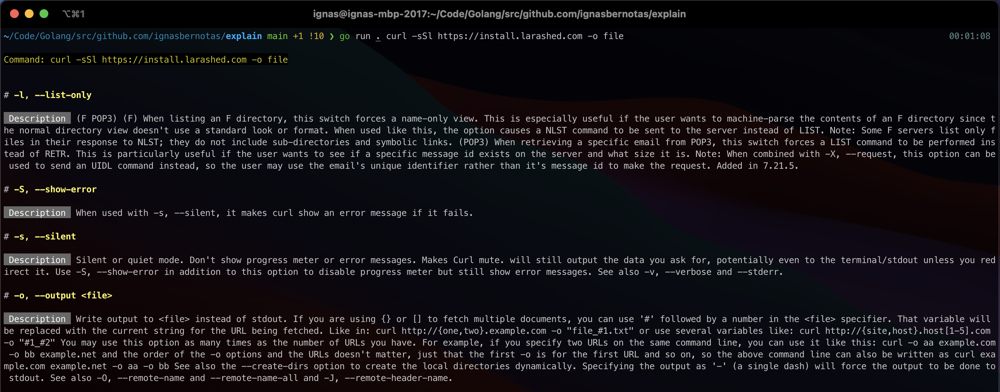
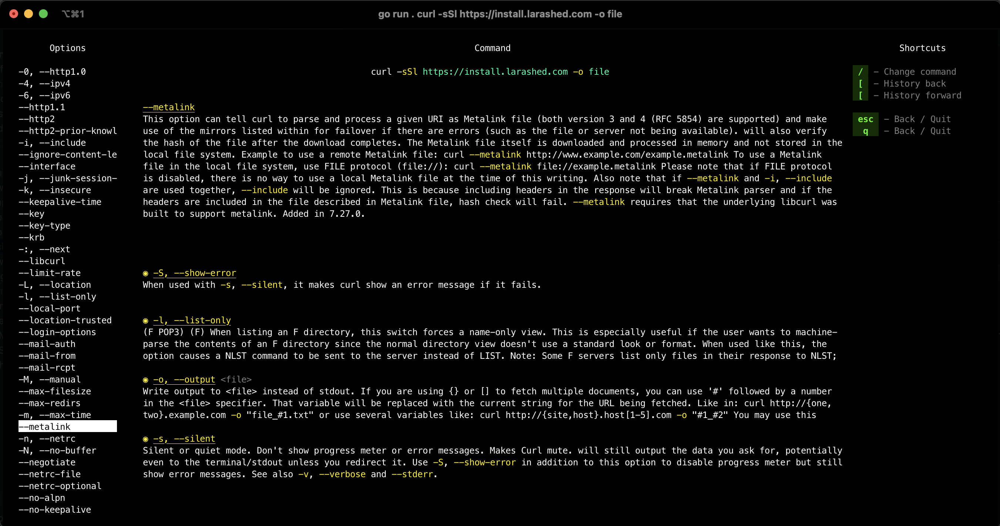
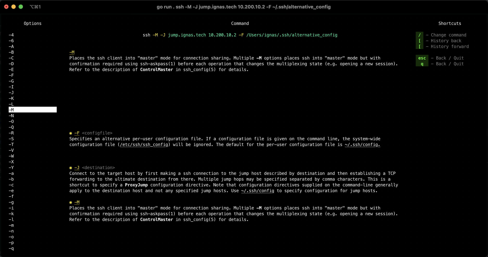

# Explain CLI app

Do you remember the difference between `curl -s` and `curl -S`? I often don't.
Surely we can run `man curl`, scroll down and read about it, but it's a little tiresome. 
Let's say your colleague sends you a command to perform some action on your local env. Going through each option is inconvenient and yet you still want to know what exactly you'll be running. 

This tool simplifies things by displaying option descriptions right in your terminal through a simple or an interactive UI.

---

**The goal of this project is to give developers a simple way to analyse most commonly used CLI tools such as `curl`, `ab`, `ssh` and eventually more moderns tools like `k8s`, `nomad`, `consul` or even language interpreters like `php`, `python`, `go` or `ruby`.**

You can read about its roadmap below.

### Usage

I will setup Github Actions in the near future for auto-builds, but for now, you have to manually build it yourself.

#### Build an executable

```shell
go get github.com/ignasbernotas/explain
```

```shell
cd $GOPATH/src/github.com/ignasbernotas/explain && go install 
```

## Running

### Non-interactive mode

```shell
explain curl -sSl https://install.larashed.com -o file
```



### Interactive mode

```shell
explain -i curl -sSl https://install.larashed.com -o file
```

### `curl`



### `ssh`




### Current implementation
`explain` attempts to read and parse `man` pages for the given command.
`man` pages use `groff`/`troff` syntax to format the output, however there's no one structure for how developers write their software manuals.
Different manuals are structured and formatted differently therefore content/structure unification isn't easily achievable.
I've only had a little time to build this, so I only tested it with `curl`, `ab` and `ssh`. 

Parsing `man` pages turned out to be more difficult than anticipated, so I took shortcuts and made some hacky attempts to do it.
I could not find a complete-enough Go implementation of a man page parser (there's only a single project on Github) so if someone has experience writing lexers/parsers and you're interested to help out, please reach out to me.

#### Dependencies:
This project uses Go modules, so all of the dependencies are defined in [go.mod](./go.mod).

Due to some limitations in the UI I had to fork and modify the [tview](https://github.com/rivo/tview) library.

### Roadmap

I've not found a modern-day tool that ships with its own `man` page.
Many modern tools are built on top of CLI frameworks that have built-in help commands, yet there's no standardized way to fetch that information without invoking each subcommand individually.
Maybe there's not enough demand for this, but for the purpose of my tool, I'll be looking at ways to make this happen.

I'll be looking to implement support for tools using these Go libraries:

- https://github.com/spf13/cobra (used by Docker, Kubernetes, Doctl, Hugo)
- https://github.com/mitchellh/cli (used by Hashicorp tools)
- https://github.com/urfave/cli (used by Grafana, Ethereum, Mysterium Network)

Thousands, if not hundreds of thousands, of projects depend on these libraries for their command-line interfaces.
It would be pretty cool if there was a unified way to generate a standardized format documentation for all of them. 

If you find this interesting, or you'd like to chat - reach out to me at [ignas@iber.lt](mailto:ignas@iber.lt) or create an issue in this repo.